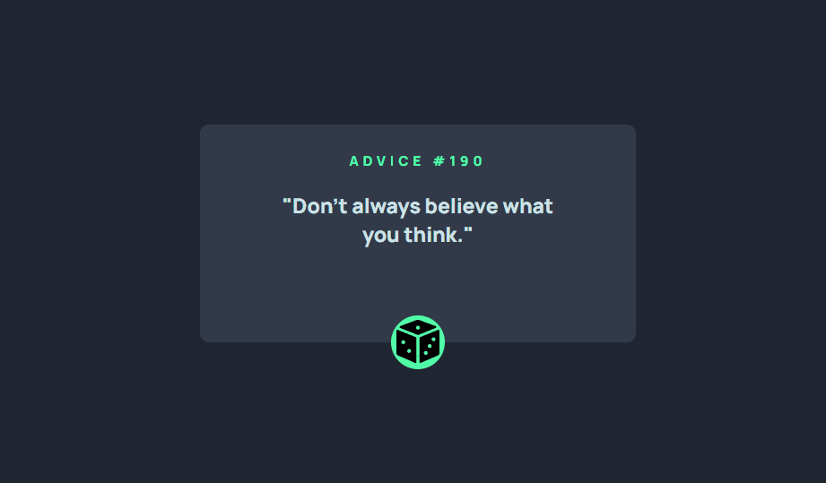

# Advice Generator

Exercício do curso DevQuest baseado no desafio do Frontend Mentor. O objetivo é a criação de um aplicativo que gere conselhos aleatórios ao clicar no botão. Para a execução desse projeto foi utilizada uma API de conselhos. 

[]

## Meu processo

### Tecnologias utilizadas

- HTML
- CSS
- JavaScript

### O que aprendi

Importância ao consumir e saber trabalhar com as informações de uma API.  
